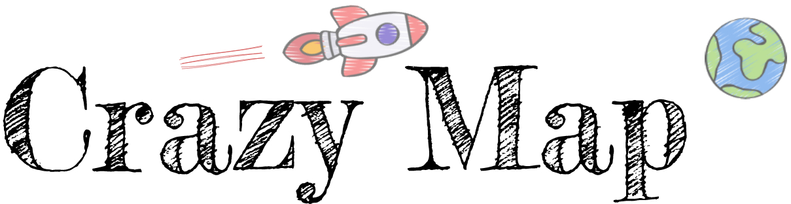

# ⚠️ WARNING : MIGRATION IN PROGRESS
We are working to update dns on a decentralized hosting.

In case of issues, use the following temporary address

<a href="https://black-voice-4172.on.fleek.co/" target="_blank">Temporary Link</a>

# 

# Crazy Map Smart Contract

Crazy Map is a smart contract for storing geolocation data of CrazyFury NFT community members into the ethereum blockchain.

## ✨ Dependency libraries

- defi-wonderland/smock for mocking and faking 
- ngeohash for encode/decode lat and lon 
- hardhat-gas-reporter to get gas metrics when running tests : 
    - Under [hardhat.config.js](hardhat.config.js) remove the comment `//require("hardhat-gas-reporter"):`


## 📖 User Stories 
Every user story managed by the smart contract is covered by related tests. See [crazymap.js](/test/crazymap.js)

For running tests, use this command:
```
npx hardhat test .\test\crazymap.js
```

> **Caveat** : Mock/Fake library used works on hardhat network only.


## 🤖 Run the webapp locally

```
cd app 
npm restore
npm start
```

### 🧑‍🚀 **First Landing** 

On first use, UI will show you this message 

> Hey Bro, only CrazyFury members can use this service. Buy CrazyFury NFT to get access.

The reason is that Goerli doesn't have a  **REAL Crazy Fury Smart Contract** deployed, so we have to simulate the NFT ownership.

For doing that : 

1. **Create ```.env``` file in the project root and set environment variables as below**

    ``` 
    ALCHEMY_GOERLI_URL=YOUR_ALCHEMY_APP_URL
    GOERLI_PRIVATE_KEY=YOUR ACCOUNT_PRIVATE_KEY 
    ```
    > Create your app on [Alchemy](http://www.alchemy.com) if you don't already have one.

2. **Open the script**

    ``` scripts/demo/mint-fake-crazyfury-nft.js ```

3. **Set your wallet address** 

    ``` const myAddress = "SET YOUR ADDRESS BEFORE RUN"; ```

4. **Run the script:**  

    ```npx hardhat run .\scripts\Demo\mint-fake-crazyfury-nft.js  --network goerli ```

### 🏠 **Add your home base**
A **Crazy Map member** is someone who have added his location and only **Crazy Map members** can see others members' locations on the map.

Let's add your location to see others members:

- double click on map where you are located now :)
- set your discord name.
- click Save.

### 🚎 **Update your home base**
Let's say you are a digital nomad and you change your home base frequently.

- double click on map where you are located now :)
- click Update.


## 🛎️ Caveats

Crazy Map smart contract has a dependency with Crazy Fury ERC721 smart contract, to check if the user ows the NFT (balanceOf).

For testing purpose a fake ERC721 called [MyFakeCrazyFuryNFT.sol](/contracts/MyFakeCrazyFuryNFT.sol) has been created in order to simulate the mainnet behaviour.

## 🖇️ Goerli smart contract references

```
Crazy Fury fake contract: 
0xC2Dddd7241a7C258c25a594007B6BB0F03207DF4

Crazy Map proxy contract:
0x9DdA4Fff341778C5E063Bed36FE15fBA28ada758
```


## 🖇️ Mainnet smart contract references

```
Crazy Fury contract: 
0x04047358179df7FE24E578219336212346dF1C07

Crazy Map proxy contract:
0x6ADa73e6192a40922E926595539D768C983B836A

Implementation 
0x49621bE3d006f1AE3C2B27482a9216B11bbDCb66
```

## 🖇️ Sepolia smart contract references

```
Crazy Fury fake contract: 
0x49621bE3d006f1AE3C2B27482a9216B11bbDCb66

Crazy Map proxy contract:
0xe85D9D9c4A470F43b41379Df30Dca1Df4e19fB6e

Implementation 
0x52D386E89E62Bf9F67126b94D730583f46D99466
```
